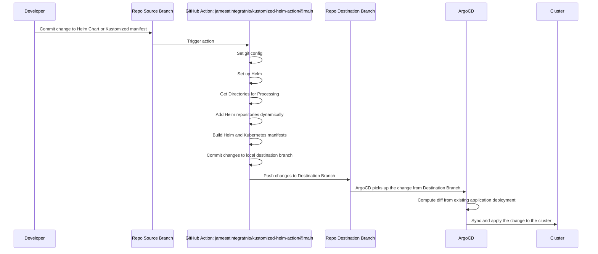

# Kustomized Helm Action for Efficient Kubernetes Deployment

This GitHub Action generates manifests for Helm charts and Kustomize overlays, allowing for easier deployment and management of Kubernetes applications. It integrates with Helm and dynamically adds Helm repositories based on the charts and overlays found in the specified source folder. The generated manifests are then templated and committed to the specified destination branch.

## Features
- **Dynamic Helm Repository Management**: Automatically adds Helm repositories based on specified source folders.
- **Complex Values Management**: Supports multiple values files for Helm charts.
- **Customizable Manifests**: Supports Helm charts and Kustomize overlays for flexible Kubernetes configurations.
- **Automated Deployment**: Integrates with CI/CD pipelines for seamless Kubernetes application management.

## Directory Structure for Helm and Kustomize

The action expects a specific directory structure in the `source_folder`. Here's an example:

```plaintext
source_folder
  myapp
    base
      Chart.yaml
      kustomization.yaml
      values.yaml
      values-dep1.yaml
      values-dep2.yaml
    overlays
      cluster1
        kustomization.yaml
        my-patch.yaml
        values.yaml
        values-dep1.yaml
        values-dep2.yaml
      cluster2
        kustomization.yaml
        values.yaml
```

In this structure, `myapp` is a Helm chart with a base configuration and two overlays, `cluster1` and `cluster2`. Each overlay can have its own `values.yaml` file and additional Kustomize patches.

## Inputs

### `source_folder`
The folder containing the Helm charts and Kustomize overlays. This input is required. The default value is `dev`.

### `destination_branch`
The branch to commit the changes to. This input is not required. The default value is the current branch of the head commit.

### `helm_version`
The version of Helm to use. This input is not required. The default value is `'v3.14.4'`.

### `include_crds`
Whether to include CRDs in the generated manifests. This input is not required. The default value is `true`.

### `dry_run`
Whether to perform a dry run without committing changes. This input is not required. The default value is `false`.

## Usage Example

Here's an example of how to use this action in a workflow:

```yaml
name: Generate Kustomized Helm Manifests

on:
  push:
    branches:
      - main

jobs:
  generate_manifests:
    runs-on: ubuntu-latest

    steps:
      - name: Checkout code
        uses: actions/checkout@v2

      - name: Generate manifests
        uses: jamesAtIntegratnIO/kustomized-helm-action@v1
        with:
          source_folder: 'dev'
          destination_branch: 'manifests'
          helm_version: 'v3.14.4'
```

In this example, the action will generate manifests for the Helm charts and Kustomize overlays in the `dev` directory and commit the changes to the `manifests` branch. It will use Helm version `v3.14.4`.

## Workflow Diagram with ArgoCD Integration

Below is a diagram of how this action integrates with ArgoCD to manage changes on a Kubernetes cluster:



## Author

This action was created by James D. For more information, visit [James D's GitHub](https://github.com/jamesatintegratnio) or my [blog](https://integratn.io) .

## Useful Links

- [Inspiration Blog from Akuity](https://akuity.io/blog/the-rendered-manifests-pattern/)
- [GitHub Actions Documentation](https://docs.github.com/en/actions)
- [Helm Official Documentation](https://helm.sh/docs/)

