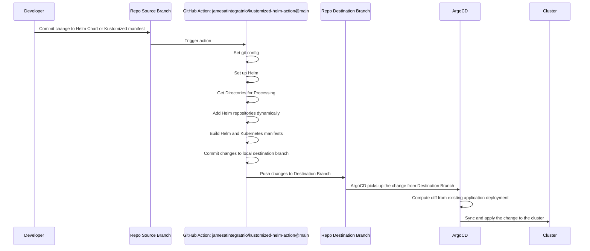

# Kustomized Helm Action

This GitHub Action generates manifests for Helm charts and kustomize overlays, allowing for easier deployment and management of Kubernetes applications. It integrates with Helm and dynamically adds Helm repositories based on the charts and overlays found in the specified source folder. The generated manifests are then templated and committed to the specified destination branch.

## Directory Structure

The action expects a specific directory structure in the `source_folder`. Here's an example:

```
source_folder
  myapp
    base
      Chart.yaml
      kustomization.yaml
      values.yaml
    overlays
      cluster1
        kustomization.yaml
        my-patch.yaml
        values.yaml
      cluster2
        kustomization.yaml
        values.yaml
```

In this structure, `myapp` is a Helm chart with a base configuration and two overlays, `cluster1` and `cluster2`. Each overlay can have its own `values.yaml` file and additional kustomize patches.

## Inputs

### `source_folder`

The folder containing the Helm charts and kustomize overlays. This input is required. The default value is `dev`.

### `destination_branch`

The branch to commit the changes to. This input is not required. The default value is the current branch of the head commit.

### `helm_version`

The version of Helm to use. This input is not required. The default value is `'v3.14.4'`.

## Usage

Here's an example of how to use this action in a workflow:

```yaml
name: Generate Kustomized Helm Manifests

on:
  push:
    branches:
      - main

jobs:
  generate_manifests:
    runs-on: ubuntu-latest

    steps:
      - name: Checkout code
        uses: actions/checkout@v2

      - name: Generate manifests
        uses: your-github-username/kustomized-helm-action@v1
        with:
          source_folder: 'dev'
          destination_branch: 'manifests'
          helm_version: 'v3.14.4'
```

In this example, the action will generate manifests for the Helm charts and kustomize overlays in the `dev` directory, and commit the changes to the `manifests` branch. It will use Helm version `v3.14.4`.

## Diagram
Below is a diagram of how I use this with ArgoCD to manage changes on my cluster.


## Author

This action was created by James D.

## Links
[Inspiration Blog from Akuity](https://akuity.io/blog/the-rendered-manifests-pattern/)